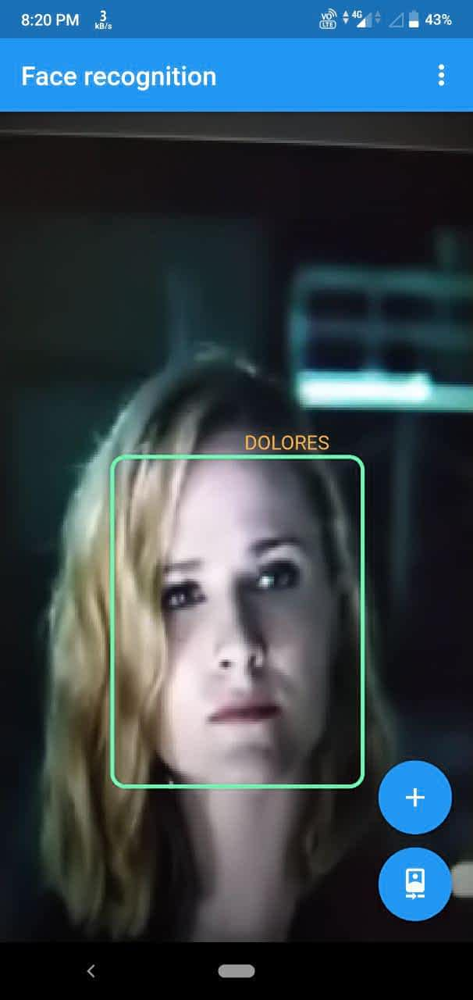
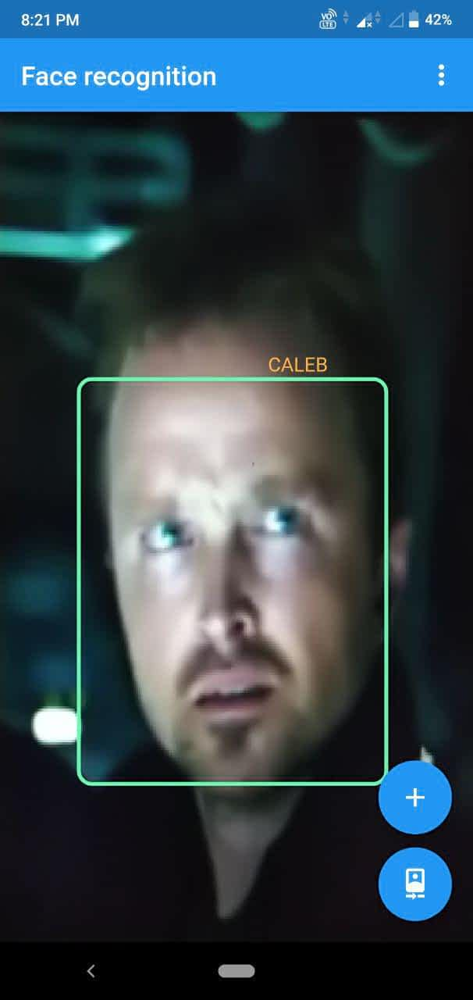

# Face Recognition Flutter

Realtime face recognition flutter app.

 [Download](https://github.com/parimaladini/ISME/main/FaceRecognition.apk) apk file.

## Steps

### Face detection

Used Firebase ML Vision to detect faces .

### Face Recognition

Convert Tensorflow implementation of [MobileFaceNet](https://github.com/sirius-ai/MobileFaceNet_TF) model into tflite.

## Installing

**Step 1:** Download or clone this repo:

```
git clone https://github.com/parimaladini/ISME.git
```

**Step 2:** Go to project root and execute the following command in console to get the required dependencies: 

```
flutter pub get 
```

**Step 3:** Add dynamic libraries for flutter_tflite package to work:

[Follow these instructions](https://pub.dev/packages/tflite_flutter#important-initial-setup)

**Step 4:** Install flutter app

```
flutter run 
```

## Recognitions

(Shots from Westworld )

<p float="left">
  
   
</p>

## Contributing

Contributions are what make the open source community such an amazing place to be learn, inspire, and create. Any contributions you make are **greatly appreciated**.
